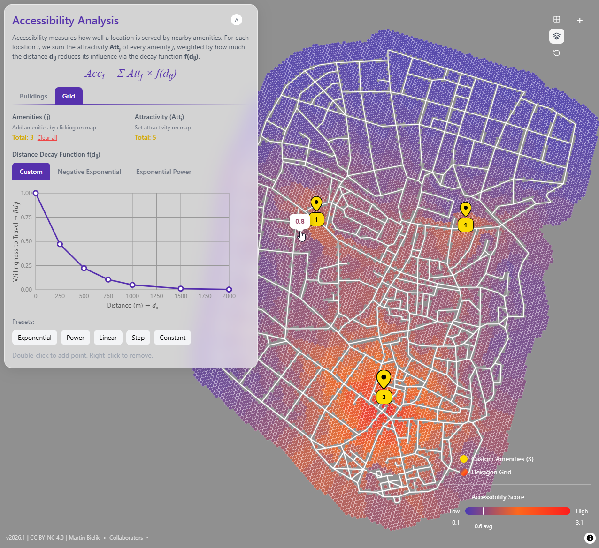
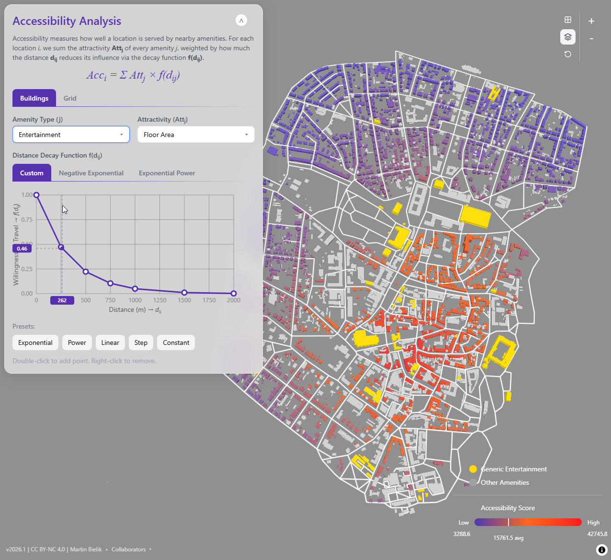
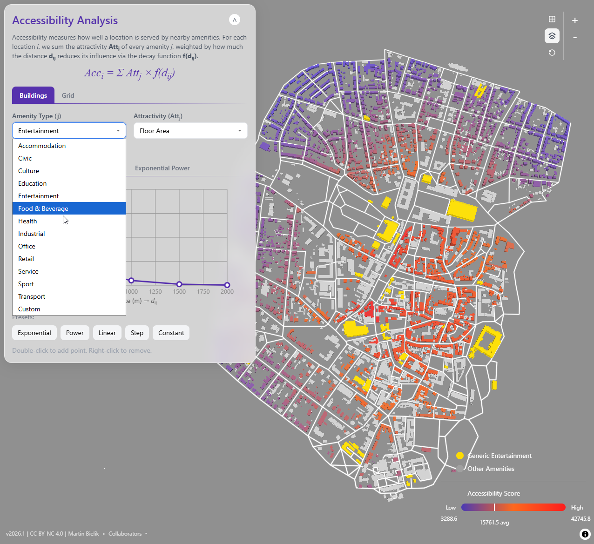
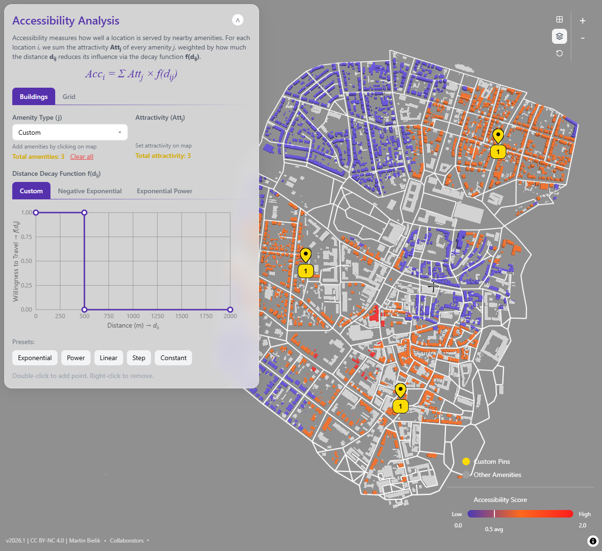

# Accessibility Analysis Builder

An interactive web application for exploring spatial accessibility analysis through distance decay functions.

## Overview

This educational tool helps students understand how accessibility scores are calculated in urban planning. Users define custom distance decay functions graphically and see how they affect accessibility scores visualized on a 3D city model.

**Live Demo**: [GitHub Pages](https://bauhaus-infau.github.io/Accessibility_UAS_2025/)

## Screenshots

### Grid Mode with Custom Amenities

*Hexagonal grid visualization with user-placed amenities and custom decay curve*

### Buildings Mode with Predefined Amenities

*Residential buildings colored by accessibility to retail amenities*

### Amenity Type Selection

*14 predefined land use types available for analysis*

### Custom Pins Mode

*User-placed custom amenity markers with editable attractivity values*

## Core Concept

Accessibility measures how well a location is served by nearby amenities. For each location *i*, the accessibility score is calculated as:

```
Acc_i = Σ Att_j × f(d_ij)
```

Where:
- **Acc_i** = accessibility score of location i
- **Att_j** = attractivity of amenity j (floor area, volume, or count)
- **f(d_ij)** = user-defined decay function (0 to 1)
- **d_ij** = shortest path distance via street network

## Features

- **Two Analysis Modes**:
  - *Buildings*: Accessibility for residential buildings based on predefined amenities
  - *Grid*: Accessibility on hexagonal grid based on user-placed custom amenities

- **Interactive Distance Decay Curve Editor**:
  - Custom polyline with draggable control points
  - Negative Exponential: f(d) = e^(-α·d)
  - Exponential Power: f(d) = e^(-(d/b)^c)
  - Preset curves (Exponential, Power, Linear, Step, Constant)

- **3D Visualization**:
  - Buildings colored by accessibility score (purple → orange → red)
  - Hexagonal grid overlay for Grid mode
  - Interactive hover popups showing raw scores

- **Custom Amenities**:
  - Click to place amenity markers on the map
  - Drag to reposition
  - Editable attractivity values
  - Right-click to remove

## Tech Stack

- TypeScript + React + Vite
- MapLibre GL JS (3D rendering)
- Tailwind CSS
- Web Worker (Dijkstra shortest path computation)

## Getting Started

### Prerequisites

- Node.js 18+
- npm

### Installation

```bash
# Clone the repository
git clone https://github.com/Bauhaus-InfAU/Accessibility_UAS_2025.git
cd Accessibility_UAS_2025

# Install dependencies
npm install

# Start development server
npm run dev
```

### Commands

| Command | Description |
|---------|-------------|
| `npm run dev` | Start development server |
| `npm run build` | Build for production |
| `npm run preview` | Preview production build |

## Data

The application uses GeoJSON data from Weimar, Germany:
- 4,316 buildings with land use classifications
- 1,183 street network segments
- 14 predefined amenity types

## License

CC BY-NC 4.0 (Creative Commons Attribution-NonCommercial)

## Author

**Martin Bielik**

### Collaborators

- Egor Gaydukov

## Acknowledgments

Adapted from [Bauhaus-InfAU/weimar-web](https://github.com/Bauhaus-InfAU/weimar-web) (data only)
