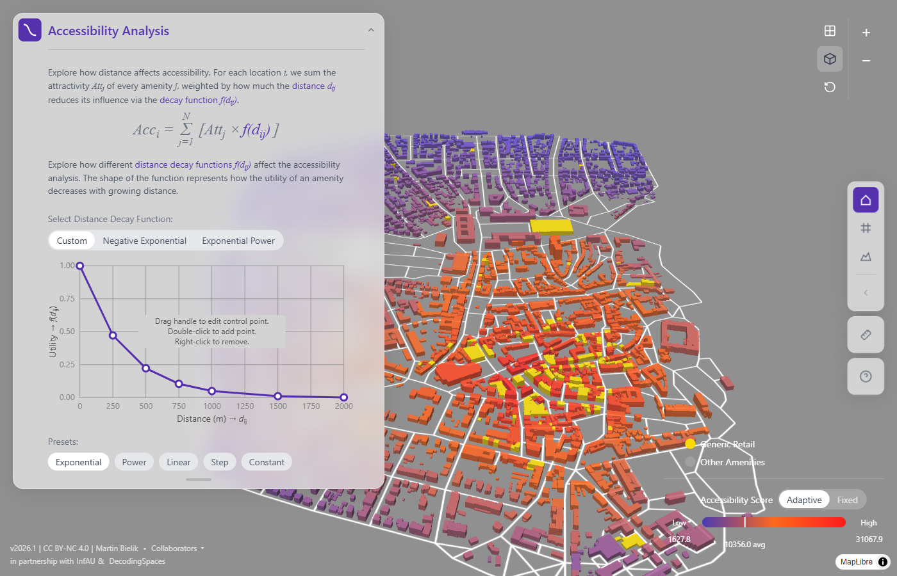
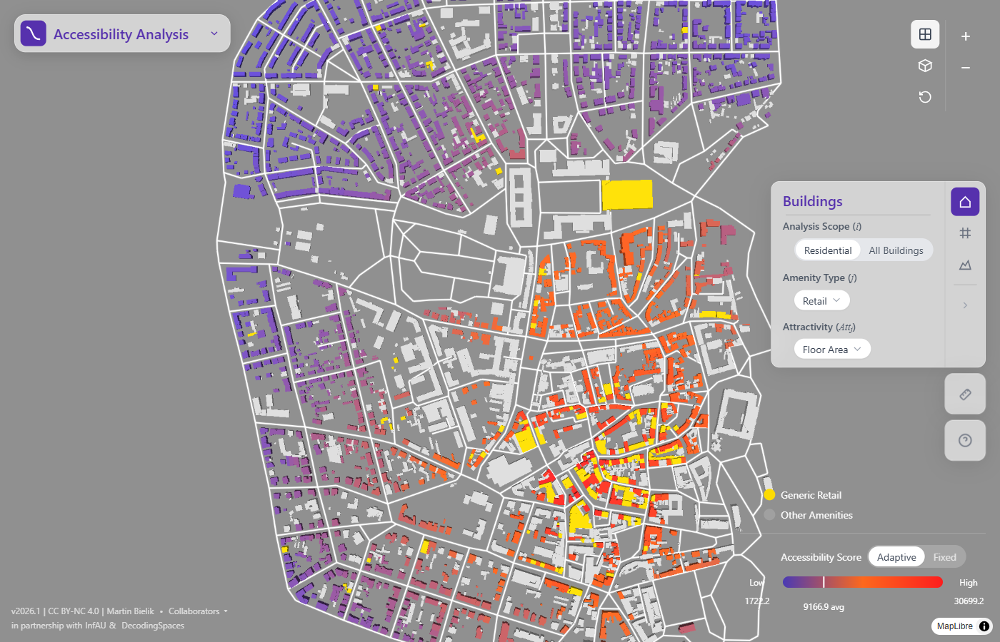
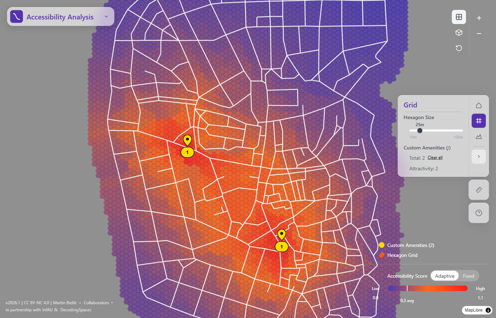
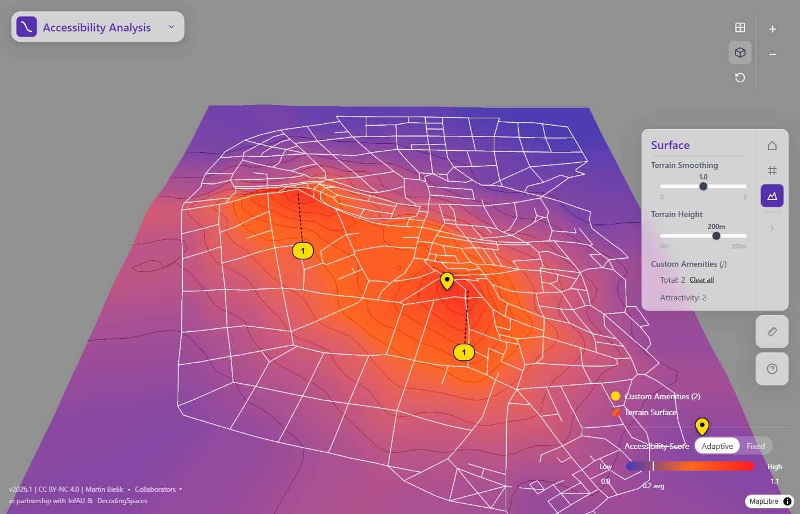
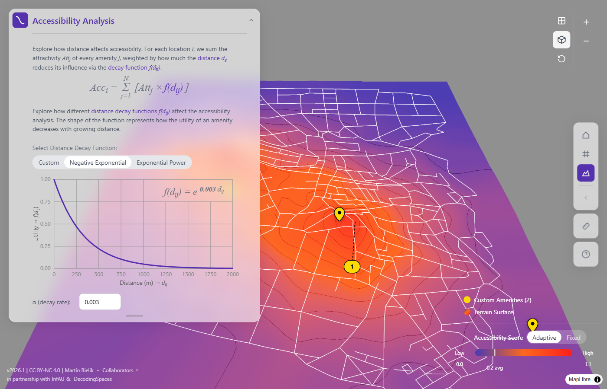
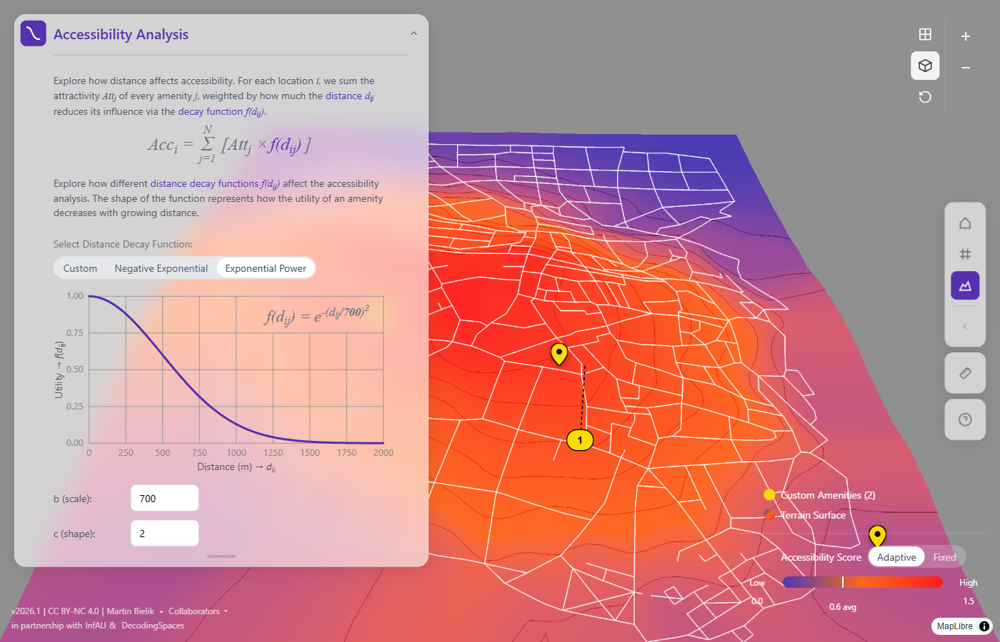
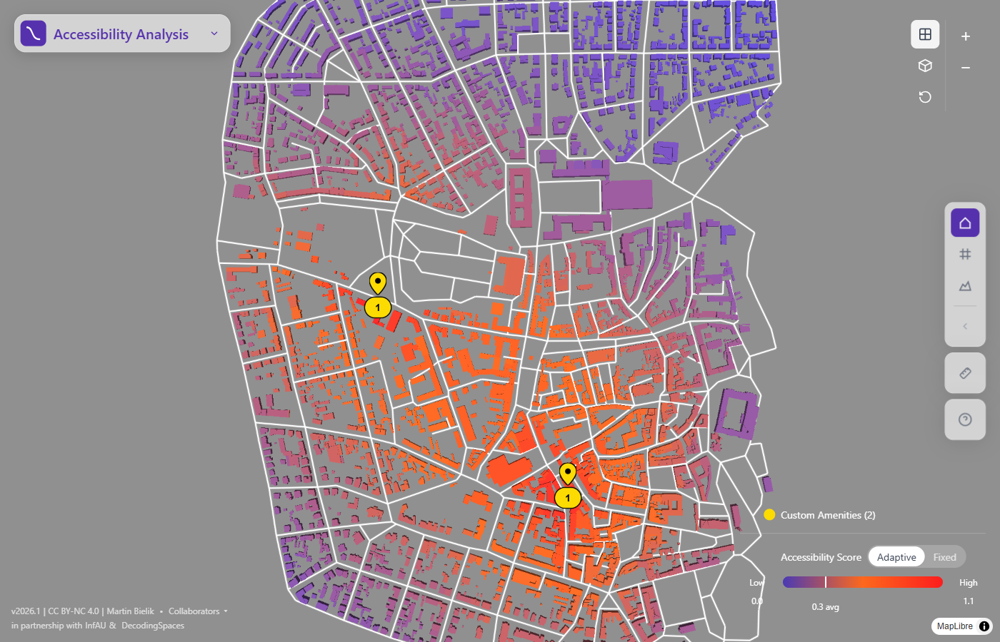
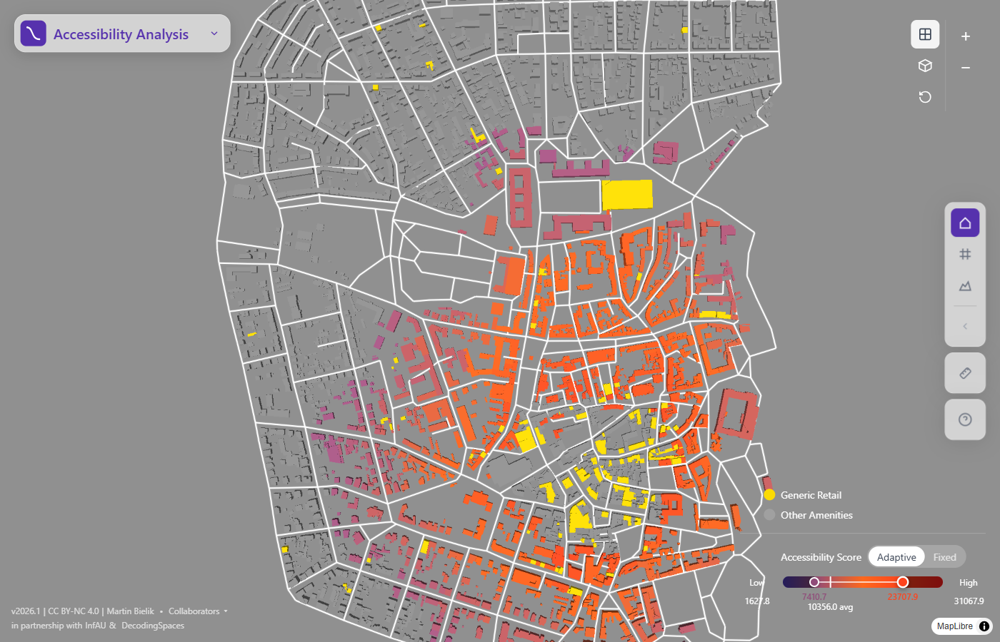
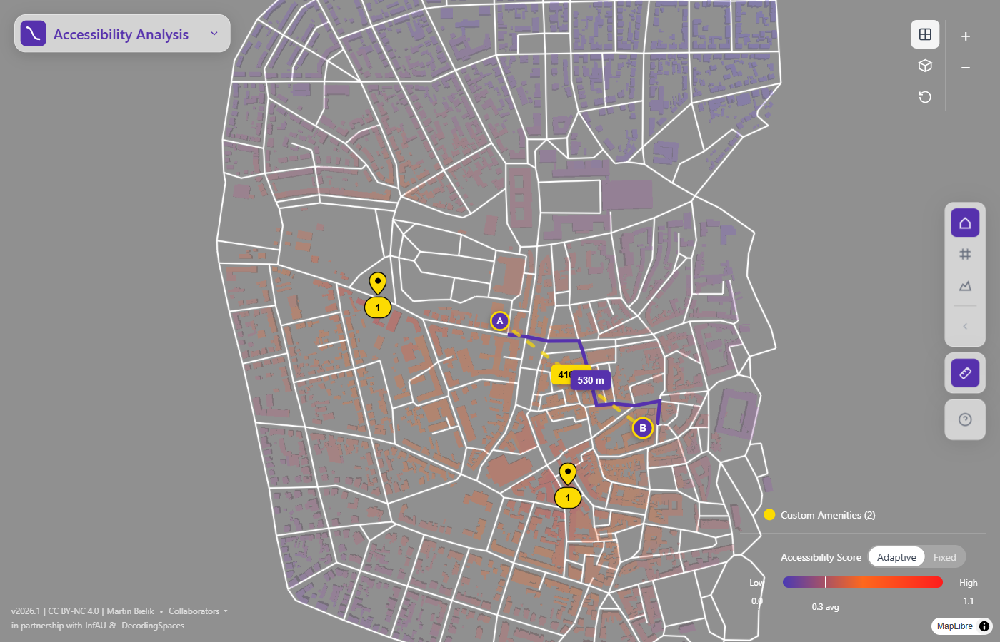
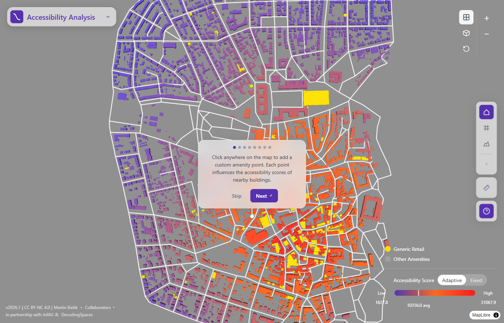

# Accessibility Analysis Builder

An interactive web application for exploring spatial accessibility analysis through distance decay functions. Built for university students learning about urban accessibility in spatial planning courses.

**Live Demo**: [bauhaus-infau.github.io/Accessibility_UAS_2025](https://bauhaus-infau.github.io/Accessibility_UAS_2025/)

## Overview

Students define a custom distance decay function *f(d)* graphically, then see how it affects accessibility scores visualized on a 3D city model of Weimar, Germany. The accessibility score for each location *i* is:

```
Acc_i = Σ Att_j × f(d_ij)
```

Where **Att_j** is the attractivity of amenity *j*, **f(d_ij)** is the user-defined decay function, and **d_ij** is the shortest path distance via the street network.


*Buildings colored by accessibility to retail amenities, with the interactive curve editor on the left*

## Features

### Three Analysis Modes

Switch between modes using the toolbar on the right side of the map.

**Buildings Mode** — Calculate accessibility for individual buildings based on proximity to 14 predefined amenity types (Retail, Education, Health, etc.) or user-placed custom pins.


*Buildings mode with Residential scope filter, Retail amenities, and Floor Area attractivity*

**Grid Mode** — Visualize accessibility on a hexagonal grid, independent of buildings. Place custom amenity points and adjust hexagon size (10-100m) for different levels of detail.


*Hexagonal grid with adjustable cell size and two custom amenity points*

**Surface Mode** — Display accessibility as a 3D terrain surface where height represents scores. Includes contour lines, street network overlay, and configurable smoothing and height parameters.


*3D terrain with contour lines, street network, and smoothing/height controls*

### Distance Decay Function Builder

Define how the utility of an amenity decreases with distance using three curve modes:

**Custom** — Drag control points on a polyline to shape any curve. Includes presets (Exponential, Power, Linear, Step, Constant). Double-click to add points, right-click to remove.

**Negative Exponential** — *f(d) = e^(-α·d)* with adjustable decay rate α.



**Exponential Power** — *f(d) = e^{-(d/b)^c}* with adjustable scale *b* and shape *c*.



### Custom Amenities & Attractivity

Place custom amenity markers anywhere on the map. Each marker has an editable attractivity value displayed in a yellow box — click the box to change the value.

- Click the map to add a new amenity point
- Drag markers to reposition
- Right-click to remove
- Works across all three analysis modes


*Custom amenity pins with attractivity values on the map*

### Score Filtering

Click and drag on the gradient bar in the legend to highlight buildings or hexagons within a specific score range. Elements outside the range are greyed out. Choose between Adaptive (data-driven) and Fixed (user-defined) gradient ranges.


*Filter range active — only buildings within the selected score range are highlighted*

### Distance Measurement Tool

Compare network distance (via streets) against straight-line (Euclidean) distance between any two points. The solid purple line shows the network path; the dashed yellow line shows the direct distance.


*Network path (530m) vs Euclidean distance shown simultaneously*

### Interactive Tutorial

An 8-step guided walkthrough introduces all features. Click the help icon to start.


*Glass morphism tooltip with step indicators and navigation*

## Tech Stack

- **TypeScript + React + Vite** — Application framework
- **MapLibre GL JS** — 3D building rendering and map interaction
- **Three.js** — Terrain mesh visualization (custom MapLibre layer)
- **Tailwind CSS** — Styling and responsive design
- **Web Worker** — Dijkstra shortest path precomputation

## Getting Started

### Prerequisites

- Node.js 18+
- npm

### Installation

```bash
git clone https://github.com/Bauhaus-InfAU/Accessibility_UAS_2025.git
cd Accessibility_UAS_2025
npm install
npm run dev
```

### Commands

| Command | Description |
|---------|-------------|
| `npm run dev` | Start development server |
| `npm run build` | Build for production |
| `npm run preview` | Preview production build |

## Data

The application uses GeoJSON data from Weimar, Germany:
- 4,316 buildings with land use classifications
- 1,183 street network segments
- 14 predefined amenity types

## License

CC BY-NC 4.0 (Creative Commons Attribution-NonCommercial)

## Author

**Martin Bielik**

### Collaborators

- Egor Gaydukov

## Partners

In partnership with:
- [Bauhaus-Universität Weimar — Chair Informatics in Architecture and Urbanism](https://www.uni-weimar.de/en/architecture-and-urbanism/chairs/infau/news/)
- [DecodingSpaces](https://decodingspaces.de/)

## Acknowledgments

Adapted from [Bauhaus-InfAU/weimar-web](https://github.com/Bauhaus-InfAU/weimar-web) (data only)
